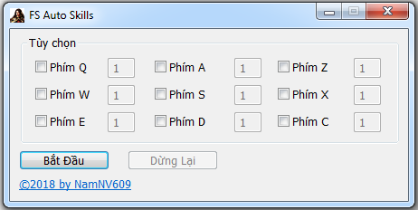

# FS Auto Skills
Auto đổi phím luyện skills chuột phải cho game Phong Thần

# Hướng dẫn sử dụng

Bạn có thể tải ngay ứng dụng và chạy nó trực tiếp hoặc nếu sợ có virus thì có thể tự build từ source code mình public bằng [Autohotkey](https://autohotkey.com/download/). Nếu bạn sử dụng Windows 7, Windows 8, Windows 8.1 hoặc Windows 10 có bật UAC (User Account Control) và khi bạn chạy game với quyền Administrator (người quản trị) thì bạn cũng hãy chạy ứng dụng này với quyền đó (Run as administrator). Bạn chỉ cần check vào phím nào bạn muốn sử dụng và nhập thời gian delay (tính bằng giây) cho phím tương ứng và bấm **Bắt Đầu**.

Do ứng dụng này mình viết bằng AutoHotkey nên có một số phần mềm diệt virus sẽ chặn.

# Thông tin file [fsAutoSkills.exe](fsAutoSkills.exe)

* Version: 1.0.0
* SHA-256: 563bf8666755b3ad607d1bfbfdba68f776f9ccfdaece70b74cee391453adcee4
* MD5: d6e95afe983598ef226d61ea37647ba2
* SHA-1: 7fe30a735dd1c8099857e6150f05160f3e658fa3
* File name: fsAutoSkills.exe
* File size: 801KB
* VirusTotal link: https://www.virustotal.com/#/file/563bf8666755b3ad607d1bfbfdba68f776f9ccfdaece70b74cee391453adcee4/detection